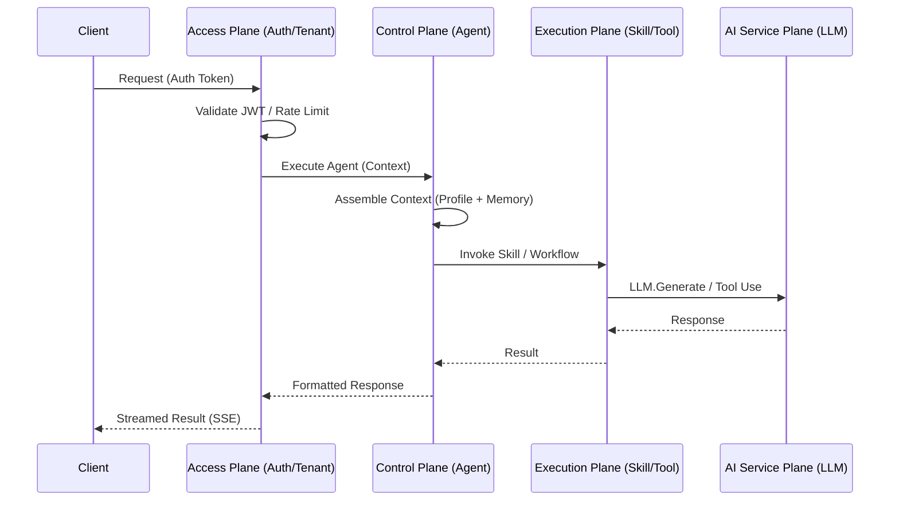

# OpenBotStack Complete System Design

> **"感知常驻，执行瞬态；人格稳定，能力可控；允许思考，不允许失控"**

---

## Development Methodology: TDD

All implementation follows **Test-Driven Development**:

```
RED → GREEN → REFACTOR
```

| Phase | Action |
|-------|--------|
| RED | Write failing test first |
| GREEN | Minimal code to pass |
| REFACTOR | Clean without breaking tests |

**Test Coverage Requirements:**
- Interfaces: 100% (contract validation)
- State machines: 100% (all transitions)
- Business logic: ≥80%

---

## Architecture Overview (7-Plane Architecture)

```
┌─────────────────────────────────────────┐
│    Application Plane (openbotstack-apps) │
│  Industry Apps (Nursing / Finance / etc) │
└───────────────▲─────────────────────────┘
                │
┌───────────────┴─────────────────────────┐
│              Client Plane               │
│  Web UI / Mobile / SDK / API Clients    │
└───────────────▲─────────────────────────┘
                │
┌───────────────┴─────────────────────────┐
│              Access Plane               │
│  API Gateway / Auth / Tenant / RateLimit│
└───────────────▲─────────────────────────┘
                │
┌───────────────┴─────────────────────────┐
│             Control Plane               │
│  Assistant / Memory / Policy / Registry │
└───────────────▲─────────────────────────┘
                │
┌───────────────┴─────────────────────────┐
│            Execution Plane              │
│  Skill Executor / Wasm Sandbox / Tool   │
└───────────────▲─────────────────────────┘
                │
┌───────────────┴─────────────────────────┐
│           AI Service Plane              │
│  LLM Router / Providers / Embeddings    │
└───────────────▲─────────────────────────┘
                │
┌───────────────┴─────────────────────────┐
│          Infrastructure Plane           │
│  Redis / Milvus / Observability / LLMs  │
└─────────────────────────────────────────┘
```

### Execution Flow



---

## Resolved Design Decisions

### D1: Model Abstraction — Capability-Based

```
┌─────────────────────────────┐
│   Skill / Workflow          │  ← 不知道 Claude / GPT
└──────────▲──────────────────┘
           │
┌──────────┴──────────────────┐
│   Model Capability Layer    │  ← text, tool-call, vision, embedding
└──────────▲──────────────────┘
           │
┌──────────┴──────────────────┐
│   Provider Adapter          │  ← Claude / OpenAI / Private
└─────────────────────────────┘
```

**Interface:**
```go
// model/capability.go
type CapabilityType string
const (
    CapTextGeneration CapabilityType = "text_generation"
    CapToolCalling    CapabilityType = "tool_calling"
    CapJSONMode       CapabilityType = "json_mode"
    CapEmbedding      CapabilityType = "embedding"
    CapVision         CapabilityType = "vision"
)

type ModelProvider interface {
    ID() string
    Capabilities() []CapabilityType
    Generate(ctx context.Context, req GenerateRequest) (*GenerateResponse, error)
}

type ModelRouter interface {
    Route(requirements []CapabilityType, constraints ModelConstraints) (ModelProvider, error)
}
```

**Providers:**
| Provider | V1 | V2 | V3 |
|----------|----|----|----| 
| OpenAI-compatible (ModelScope, DeepSeek, etc.) | ✅ | ✅ | ✅ |
| Claude (native API) | - | ✅ | ✅ |
| vLLM (private) | - | ✅ | ✅ |
| Ollama | - | ✅ | ✅ |
| Kimi/GLM/OpenRouter | - | Stub | ✅ |

> **V1 Note:** The runtime uses a single OpenAI-compatible HTTP client. Any provider exposing an OpenAI-compatible `/chat/completions` endpoint (ModelScope, DeepSeek, SiliconFlow, etc.) works out of the box. Native provider adapters for non-compatible APIs are planned for V2.

---

### D2: Skill Packaging — Wasm-First

```
skill/
 ├── manifest.yaml      # metadata, capabilities, constraints
 ├── skill.wasm         # compiled module
 └── assets/            # static files
```

**Interface:**
```go
// skill/package.go
type SkillPackage interface {
    Manifest() *SkillManifest
    LoadModule(ctx context.Context) (WasmModule, error)
}

type SkillManifest struct {
    ID          string
    Version     string
    Requires    []CapabilityType
    Permissions []string
    Timeout     time.Duration
    Resources   ResourceLimits
}

type WasmModule interface {
    Execute(ctx context.Context, input []byte) ([]byte, error)
    Close() error
}
```

**Host APIs exposed to Wasm:**
| API | V1 | V2 |
|-----|----|----|
| LLM.Generate | ✅ | ✅ |
| KV.Get/Set | ✅ | ✅ |
| HTTP.Fetch | ✅ | ✅ |
| Secrets.Get | ✅ | ✅ |
| Memory.Store/Retrieve | - | ✅ |

**API Skills (escape hatch):**
```go
type APISkillAdapter interface {
    Call(ctx context.Context, endpoint string, payload []byte) ([]byte, error)
}
```

---

### D3: Rate Limiting — Hierarchical Quota

```
Global
 └── Tenant  (hard limit, billing)
      └── User  (soft limit, fairness)
           └── Skill  [V2]
```

**Interface:**
```go
// ratelimit/limiter.go
type RateLimiter interface {
    Allow(ctx context.Context, key RateLimitKey) (bool, error)
    Consume(ctx context.Context, key RateLimitKey, tokens int) error
    Remaining(ctx context.Context, key RateLimitKey) (int, error)
}

type RateLimitKey struct {
    TenantID string
    UserID   string  // optional
    SkillID  string  // optional, V2
}

type QuotaConfig struct {
    TenantTokensPerMinute int64
    UserRequestsPerMinute int64
}
```

**Storage:** Redis with Token Bucket
```
rate:tenant:{tenant_id}
rate:user:{tenant_id}:{user_id}
```

---

### D4: Runtime Scaling — Stateless + Externalized State

```
Runtime instance = disposable worker
```

| State | Storage | Version |
|-------|---------|---------|
| Session/Memory | Redis | V1 |
| Skill artifacts | Object Storage (MinIO) | V1 |
| Logs/Traces | OTel Collector | V1 |
| Rate limits | Redis | V1 |
| Model cache | Local + warmup | V2 |

**Execution Model:**
```
HTTP Request → Async Job → Streaming/SSE Response
```

---

## Component Inventory by Version

### V1: Minimal Viable Platform

| Component | Package | Description |
|-----------|---------|-------------|
| Skill | `skill/` | Interface + Wasm loader |
| SkillRegistry | `skill/` | In-memory registry |
| AgentStateMachine | `agent/` | 7-state machine |
| MemoryManager | `memory/` | Redis short-term, Milvus long-term |
| ModelProvider | `model/` | Claude + OpenAI adapters |
| ModelRouter | `model/` | Capability-based routing |
| RateLimiter | `ratelimit/` | Tenant + User buckets |
| AuditLogger | `audit/` | PostgreSQL structured logs |
| SkillExecutor | `runtime/` | Wasm executor + timeout |
| WebChannel | `channels/` | React chat UI |
| APIChannel | `channels/` | REST endpoints |

### V2: Enterprise Features

| Component | Package | Description |
|-----------|---------|-------------|
| TenantManager | `admin/` | CRUD + model config |
| UserManager | `admin/` | CRUD + permissions |
| AssistantProfileManager | `admin/` | Persona + skills |
| PolicyEngine | `policy/` | Permission evaluation |
| ContextAssembler | `context/` | Profile + memory → prompt |
| ReflectionController | `agent/` | Bounded self-check |
| CircuitBreaker | `runtime/` | Failure isolation |
| SkillMarketplace | `marketplace/` | Discovery + install |
| DingTalkBot | `channels/` | Webhook handler |
| FeishuBot | `channels/` | Webhook handler |

### V3: Scale & Ecosystem

| Component | Package | Description |
|-----------|---------|-------------|
| SlackBot | `channels/` | Bolt SDK |
| SkillVersioning | `skill/` | Hot reload |
| PerSkillRateLimit | `ratelimit/` | Skill-level quotas |
| ModelCache | `model/` | Warmup + local cache |
| AdvancedProviders | `model/` | Kimi/GLM/OpenRouter |
| ContainerSandbox | `runtime/` | Docker isolation |

---

## Interface Additions (openbotstack-core)

### New Files Needed

```
openbotstack-core/
├── model/
│   ├── capability.go      # CapabilityType, ModelProvider, ModelRouter [V1]
│   ├── provider.go        # Provider interface [V1]
│   └── constraints.go     # ModelConstraints [V1]
├── ratelimit/
│   ├── limiter.go         # RateLimiter interface [V1]
│   ├── config.go          # QuotaConfig [V1]
│   └── errors.go          # Errors [V1]
├── context/
│   ├── assembler.go       # ContextAssembler interface [V1]
│   └── types.go           # AssembledContext [V1]
└── runtime/
    └── executor.go        # SkillExecutor interface (in core) [V1]
```

---

## Epic Breakdown by Version

### V1 Epics (MVP)

| Epic | Stories | Estimate |
|------|---------|----------|
| E1: Core Interfaces | 8 stories | 16h |
| E2: Model Abstraction | 5 stories | 12h |
| E3: Wasm Skill Loader | 4 stories | 10h |
| E4: Rate Limiting | 3 stories | 6h |
| E5: Runtime Foundation | 6 stories | 14h |
| E6: Memory Subsystem | 4 stories | 10h |
| E7: Web Channel MVP | 4 stories | 10h |
| **Total V1** | **34 stories** | **~78h** |

### V2 Epics (Enterprise)

| Epic | Stories | Estimate |
|------|---------|----------|
| E8: Admin Plane | 5 stories | 12h |
| E9: Policy Engine | 4 stories | 10h |
| E10: Context Assembly | 3 stories | 8h |
| E11: Circuit Breaker | 2 stories | 4h |
| E12: Chat Channels | 4 stories | 10h |
| **Total V2** | **18 stories** | **~44h** |

### V3 Epics (Scale)

| Epic | Stories | Estimate |
|------|---------|----------|
| E13: Skill Versioning | 3 stories | 8h |
| E14: Advanced Providers | 4 stories | 10h |
| E15: Container Sandbox | 3 stories | 8h |
| **Total V3** | **10 stories** | **~26h** |

---

## Decision Log (Updated)

| # | Decision | Rationale | Version |
|---|----------|-----------|---------|
| D1 | Capability-based model abstraction | Provider-agnostic, future-proof | V1 |
| D2 | Wasm-first skill packaging | Sandbox, distributable, multi-lang | V1 |
| D3 | Hierarchical rate limiting | Tenant billing + user fairness | V1 |
| D4 | Stateless runtime | Horizontal scale, no sticky sessions | V1 |
| D5 | Async skill execution | SSE/streaming, not blocking HTTP | V1 |
| D6 | Go 1.25 | User environment constraint | V1 |
| D7 | API skill as escape hatch | Legacy/GPU workloads | V2 |
| D8 | Per-skill rate limits | Fine-grained control | V2 |

---

